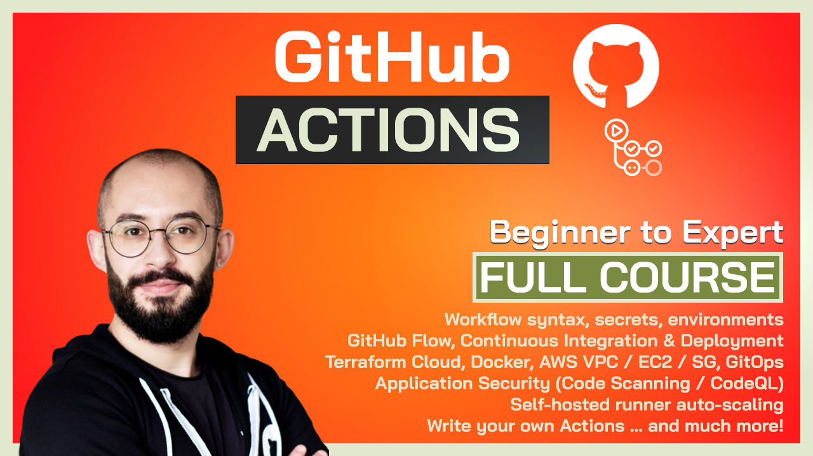

# Infrastructure as Code (IaC) Introduction

> TLDR; This repository is a sample project demonstrating the basics of managing Infrastructure as Code (IaC) using Terraform Cloud and AWS.

## Course attachement

> This repository is best consumed while or after following the course attachment 👇

